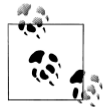

.. contents:: Table of Contents
.. section-numbering::

|reST|
===========

   This is the caption of the figure (a simple paragraph).

   The legend consists of all elements after the caption.  In this
   case, the legend consists of this paragraph and the following
   table:

   +-----------------------+-----------------------+
   | Symbol                | Meaning               |
   +=======================+=======================+
   | .. image:: tent.png   | Campground            |
   +-----------------------+-----------------------+
   | .. image:: waves.png  | Lake                  |
   +-----------------------+-----------------------+
   | .. image:: peak.png   | Mountain              |
   +-----------------------+-----------------------+

`Frozen Delights!`_

.. topic:: Topic Title

    Subsequent indented lines comprise
    the body of the topic, and are
    interpreted as body elements.

.. sidebar:: Sidebar Title
   :subtitle: Optional Sidebar Subtitle

   Subsequent indented lines comprise
   the body of the sidebar, and are
   interpreted as body elements.

.. line-block::

        Lend us a couple of bob till Thursday.
        I'm absolutely skint.
        But I'm expecting a postal order and I can pay you back
            as soon as it comes.
        Love, Ewan.

.. compound::

   The 'rm' command is very dangerous.  If you are logged
   in as root and enter ::

       cd /
       rm -rf *

   you will erase the entire contents of your file system.

.. table:: Truth table for "not"

   =====  =====
     A    not A
   =====  =====
   False  True
   True   False
   =====  =====

.. csv-table:: Frozen Delights!
   :header: "Treat", "Quantity", "Description"
   :widths: 15, 10, 30

   "Albatross", 2.99, "On a stick!"
   "Crunchy Frog", 1.49, "If we took the bones out, it wouldn't be
   crunchy, now would it?"
   "Gannet Ripple", 1.99, "On a stick!"

.. list-table:: _`Frozen Delights!`
   :widths: 15 10 30
   :header-rows: 1

   * - Treat
     - Quantity
     - Description
   * - Albatross
     - 2.99
     - On a stick!
   * - Crunchy Frog
     - 1.49
     - If we took the bones out, it wouldn't be
       crunchy, now would it?
   * - Gannet Ripple
     - 1.99
     - On a stick!
       

.. |reST| replace:: reStructuredText

Autonumbered footnotes are
possible, like using [#]_ and [#]_.

.. [#] This is the first one.
.. [#] This is the second one.

------------------

They may be assigned 'autonumber
labels' - for instance,
[#fourth]_ and [#third]_.

.. [#third] a.k.a. third_

.. [#fourth] a.k.a. fourth_ 

>>> print "This is a doctest block."
This is a doctest block.

:what: Field lists map field names to field bodies, like database
       records.  They are often part of an extension syntax.  They are
       an unambiguous variant of RFC 2822 fields.

:how arg1 arg2:

    The field marker is a colon, the field name, and a colon.

    The field body may contain one or more body elements, indented
    relative to the field marker.

-a            command-line option "a"
-b file       options can have arguments
              and long descriptions
--long        options can be long also
--input=file  long options can also have
              arguments

--very-long-option
              The description can also start on the next line.

              The description may contain multiple body elements,
              regardless of where it starts.

-x, -y, -z    Multiple options are an "option group".
-v, --verbose  Commonly-seen: short & long options.
-1 file, --one=file, --two file
              Multiple options with arguments.
/V            DOS/VMS-style options too

.. sidebar:: Sidebar Title
   :subtitle: Optional Subtitle

   This is a sidebar.  It is for text outside the flow of the main
   text.  

   .. rubric:: This is a rubric inside a sidebar

   Sidebars often appears beside the main text with a border and
   background color.

.. topic:: Topic Title

   This is a topic.

.. rubric:: This is a rubric
